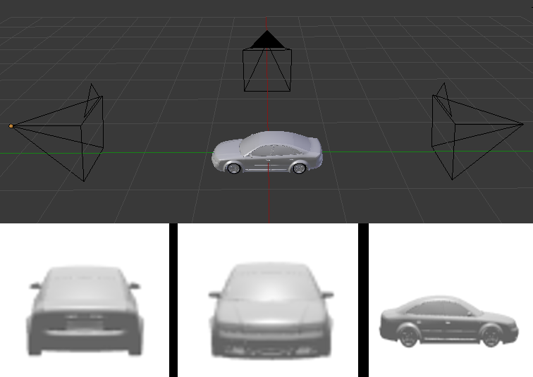

# Cooperative Object Classification for Driving Applications 


This project aims at evaluating cooperative approaches towards object classification on monocular images. It renders 3D meshes into images from three different viewpoints and evaluate the impact of occlusion and sensor noise into the classification result.
Ten object classes of interest for a Driving application are considered: animal, bike, trash can (bin), bus, car, mailbox, motorbike, person and truck.
The paper containing the results of this research activity was published [here](https://ieeexplore.ieee.org/abstract/document/8813811).
Please cite using
```
@INPROCEEDINGS{8813811,
  author={E. {Arnold} and O. Y. {Al-Jarrah} and M. {Dianati} and S. {Fallah} and D. {Oxtoby} and A. {Mouzakitis}},
  booktitle={2019 IEEE Intelligent Vehicles Symposium (IV)}, 
  title={Cooperative Object Classification for Driving Applications}, 
  year={2019},
  volume={},
  number={},
  pages={2484-2489}
}
```
## :gear: Environment Setup
We used PyTorch 1.0.1 with CUDA toolkit 8.0. You can set up and activate the exact conda environenment using:
```
conda env create -f environment.yml -n coopclassification 
conda activate coopclassification
```

## :camera: Downloading the Dataset
The dataset is generated from a subsample of textureless 3D meshes provided in the Shapenet dataset for the classes of interest. The images are created with the Blender render engine. 
The folders are separated in training and testing. For testing, we render occlusion boxes around the objects to investigate the impact of occlusion.
We vary the size of the occluding box as a percentage of the size of the object, resulting in multiple test folders, each labeled as `test_OCC` where `OCC` is the percentage of the occlusion size relative to the objects size.
For simplicity we provide the rendered dataset in a compressed file [here](https://drive.google.com/file/d/1t5U2PaM5G9e04KEJ_-0pSgIHSAgfaXRg/view?usp=sharing).
Download it and extract within the `data` folder.

The dataset class distribution can be observed using `python dataset_histogram.py`.

## :books: Training
To train the models for each experiment use
```
python train.py
```
The trained models will be stored within the folder `models`, one for each fusion scheme (voting, view-pooling and concatenation) as well for models for individual view (single-view 0, single-view 1, single-view 2).

## :chart: Evaluation
The models can be evaluated for experiment number `X` using 
```
python test.py expX
```
Each experiment is described in the next section.
This will create evaluation files for each experiment in the results folder `results/expX`

After the evaluation script is run, the results can be visualised using 
```
python plot_results.py expX
```

## :clipboard: Experiments Description
The training and testing functions are labeled according to the experiment conducted. A description of each experiment is listed below:

1. Train and test on impairment free data
2. Train on impairment free, evaluate with fixed occlusion size 0.3
3. Train on impairment free, evaluate with fixed occlusion 0.3 and additive gaussian noise sigma 0.05
4. Train on impaired data, evaluate on different occlusion sizes
5. Train on impaired data, evaluate on different gaussian noise powers
6. Train on impaired data, evaluate with same occlusion level (0.3) but with random object orientation
